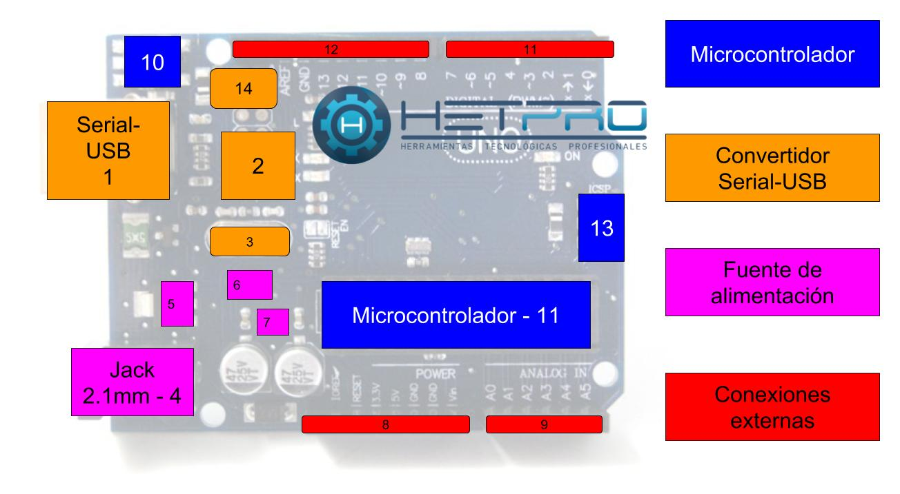

# Introducción a Arduino: placa, entradas y salidas.

## 1.¿Qué es Arduino?

Imagina que Arduino es un pequeño computador, pero a diferencia de una laptop, no tiene pantalla ni teclado. Su trabajo es leer lo que pasa afuera (con sensores) y decidir qué hacer (encender luces o mover motores).

## 2.Anatomía de la Placa (Las partes del cuerpo)

El Microcontrolador (El Cerebro): Es el chip negro rectangular. Ahí es donde guardamos las instrucciones que escribimos.

El Puerto USB (La Boca): Por aquí "alimentamos" a Arduino con el código que hacemos en la computadora. También le da energía.

Jack de Alimentación (El Estómago): Sirve para conectar una batería si queremos que nuestro proyecto funcione sin estar pegado a la computadora.

Los Pines (Los Dedos): Son los hoyitos con números. Sirven para conectarse con otros componentes.

## 3.Entradas y Salidas: ¿Cómo se comunica?

Arduino tiene dos formas de interactuar:
- **A. Salidas (Output) - "Arduino Actúa" 📢**
Es cuando el cerebro envía electricidad hacia afuera para que algo suceda.
Ejemplos: Encender un LED, hacer sonar una bocina (piezo), girar un motor.
Analogía: Es como cuando tu cerebro le dice a tu mano: "¡Saluda!".

- **B. Entradas (Input) - "Arduino Siente" 👀**
Es cuando el cerebro recibe información del mundo exterior.
Ejemplos: Un botón presionado, un sensor que detecta luz, un sensor que mide la distancia.
Analogía: Es como cuando tus ojos ven que el semáforo está en rojo y le envían esa información a tu cerebro.

## 4.Señales Digitales vs. Analógicas: ¿Cómo habla el mundo? 🚥

Arduino puede entender dos tipos de "idiomas" o señales. Imagina que son formas distintas de recibir información:
- **1. Señales Digitales⚪⚫**
Es la señal más simple. Solo tiene dos estados posibles: ENCENDIDO o APAGADO (en programación usamos 1 y 0). No hay puntos medios.
Ejemplo de la vida real: Un interruptor de luz. La luz está prendida o está apagada.
En Arduino: Un botón (pulsado o no pulsado) o un LED (encendido o apagado).
Cómo se ve: Como una escalera cuadrada. Sube de golpe y baja de golpe.

- **2. Señales Analógicas (La Perilla) 🌀**
Estas señales son más detalladas. Pueden tener muchos valores intermedios. No es solo "sí o no", es "¿qué tanto?".
Ejemplo de la vida real: El control de volumen de un radio o una perilla para atenuar la luz (dimmer). Puedes tener un poquito de volumen, la mitad, o todo.
En Arduino: Un sensor de luz (LDR) que detecta si está "un poco oscuro" o "muy brillante", o un potenciómetro.
Cómo se ve: Como una montaña rusa o una ola del mar. Sube y baja suavemente.

## 5.Parpadeo de LED

### Conexión física

### Diagrama

### Reto: Semáforo (verde 5s, amarillo 1.5s y rojo 3s)

## 6.Botón

### Conexión física 2 terminales

### Conexión física 4 terminales

### Diagrama

## 7.LED RGB

### Conexión física

## 8.Potenciometro

### Conexión física

