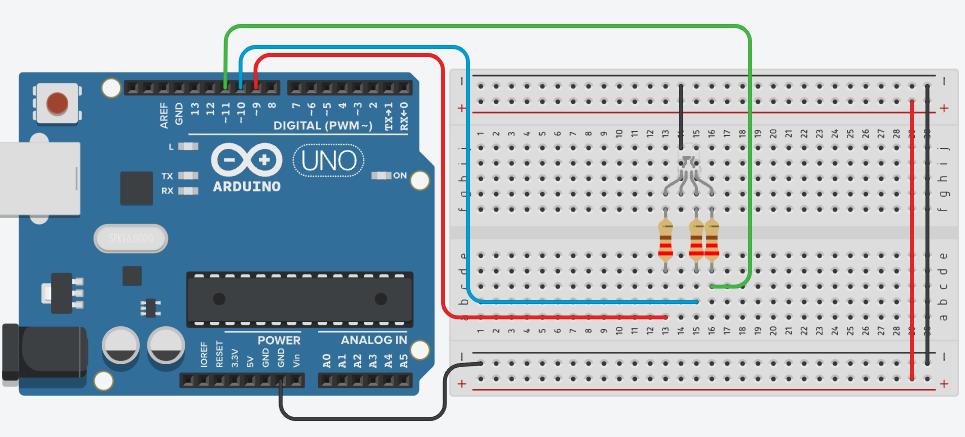
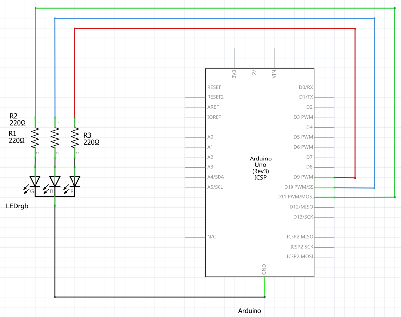
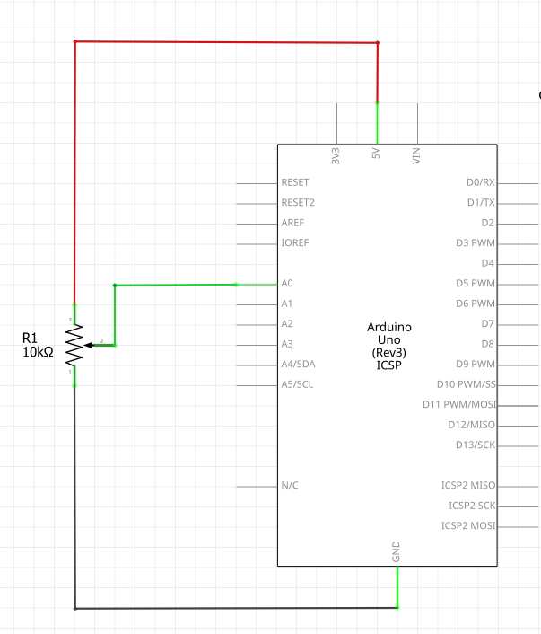

# Introducción a Arduino: placa, entradas y salidas.

## 1.¿Qué es Arduino?

Imagina que Arduino es un pequeño computador, pero a diferencia de una laptop, no tiene pantalla ni teclado. Su trabajo es leer lo que pasa afuera (con sensores) y decidir qué hacer (encender luces o mover motores).

## 2.Anatomía de la Placa (Las partes del cuerpo)

El Microcontrolador (El Cerebro): Es el chip negro rectangular. Ahí es donde guardamos las instrucciones que escribimos.

El Puerto USB (La Boca): Por aquí "alimentamos" a Arduino con el código que hacemos en la computadora. También le da energía.

Jack de Alimentación (El Estómago): Sirve para conectar una batería si queremos que nuestro proyecto funcione sin estar pegado a la computadora.

Los Pines (Los Dedos): Son los hoyitos con números. Sirven para conectarse con otros componentes.

## 3.Entradas y Salidas: ¿Cómo se comunica?

Arduino tiene dos formas de interactuar:
- **A. Salidas (Output) - "Arduino Actúa" 📢**
Es cuando el cerebro envía electricidad hacia afuera para que algo suceda.
Ejemplos: Encender un LED, hacer sonar una bocina (piezo), girar un motor.
Analogía: Es como cuando tu cerebro le dice a tu mano: "¡Saluda!".

- **B. Entradas (Input) - "Arduino Siente" 👀**
Es cuando el cerebro recibe información del mundo exterior.
Ejemplos: Un botón presionado, un sensor que detecta luz, un sensor que mide la distancia.
Analogía: Es como cuando tus ojos ven que el semáforo está en rojo y le envían esa información a tu cerebro.

## 4.Señales Digitales vs. Analógicas: ¿Cómo habla el mundo? 🚥

Arduino puede entender dos tipos de "idiomas" o señales. Imagina que son formas distintas de recibir información:
- **1. Señales Digitales⚪⚫**
Es la señal más simple. Solo tiene dos estados posibles: ENCENDIDO o APAGADO (en programación usamos 1 y 0). No hay puntos medios.
Ejemplo de la vida real: Un interruptor de luz. La luz está prendida o está apagada.
En Arduino: Un botón (pulsado o no pulsado) o un LED (encendido o apagado).
Cómo se ve: Como una escalera cuadrada. Sube de golpe y baja de golpe.

- **2. Señales Analógicas🌀**
Estas señales son más detalladas. Pueden tener muchos valores intermedios. No es solo "sí o no", es "¿qué tanto?".
Ejemplo de la vida real: El control de volumen de un radio o una perilla para atenuar la luz (dimmer). Puedes tener un poquito de volumen, la mitad, o todo.
En Arduino: Un sensor de luz (LDR) que detecta si está "un poco oscuro" o "muy brillante", o un potenciómetro.
Cómo se ve: Como una montaña rusa o una ola del mar. Sube y baja suavemente.

## 5.Parpadeo de LED (Salida digital [0 (apagado) - 1 (prendido)])

**LED (El Mensajero de Luz) 💡**
Es un componente que transforma la energía eléctrica en luz visible.
- Función: Sirve para darnos señales visuales (ej. "el proceso terminó" o "hay un error").
- Dato Clave: Solo deja pasar la electricidad en un sentido. Tiene una pata larga (Ánodo / Positivo) y una corta (Cátodo / Negativo).
- Analogía: Es como una calle de un solo sentido; si entras por el lado equivocado, no avanzas (no prende).

### Conexión física

### Diagrama

### Reto: Semáforo (verde 5s, amarillo 1.5s y rojo 3s)

## 6.Push button - Botón (Entrada digital [0 (no oprimido) - 1 (oprimido)])

**Push Button / Pulsador (El Interruptor de Acción) 🔘**
Es un componente que permite o interrumpe el paso de la corriente solo cuando lo presionamos.
- Función: Es el sensor digital más básico. Envía un "1" (presionado) o un "0" (suelto) al Arduino.
- Dato Clave: Tiene 4 patas, pero funcionan en pares. Al presionarlo, "cerramos el puente" para que los electrones crucen.
- Analogía: Es como el timbre de una casa; solo suena mientras mantienes el dedo puesto.

### Conexión física 2 terminales

### Conexión física 4 terminales

### Diagrama

### Reto 1: Cambia el comportamiento del botón, cuando lo oprimas el LED se debe apagar y cuando no esté oprimido se debe de encender el LED.

### Reto 2: Cuando oprimas el botón el LED se debe encender durante 5 segundos, cuando no se oprime no se enciende.

**📦 La Variable: "La Caja Mágica con Nombre"**
Imagina que una variable es una caja de cartón.
- Tiene un nombre: Para no confundirla con otras cajas, le pegas una etiqueta por fuera (por ejemplo: "Puntos", "Color" o "Edad").
- Guarda algo adentro: Dentro de la caja puedes guardar un dato (un número, una palabra o un estado).
- Su contenido cambia: Lo más importante es que puedes abrir la caja, sacar lo que hay y meter algo nuevo. Por eso se llama "variable", ¡porque su valor varía!

### Reto 3: Realiza el programa para que el led se encienda cuando se oprime el botón y se apague cuando no se oprima, usando una variable llamada valorBoton.

## 7.LED RGB (Salida analógica [0 - 255])

**LED RGB (El Camaleón) 🌈**
A diferencia del LED común, este tiene 4 patas y puede brillar de cualquier color.
- Función: Mezclar los tres colores primarios de la luz (Red/Rojo, Green/Verde, Blue/Azul) para crear miles de combinaciones.
- Dato Clave: Una pata es común (va a Tierra o a 5V) y las otras tres controlan cada color. Si prendes el Rojo y el Azul al mismo tiempo, ¡verás color violeta!
- Analogía: Es como una caja de crayolas mágica condensada en un solo foco.

### Conexión física

### Diagrama

### Programación básica

### Reto: Realiza una serie de los principales colores, debe de cambiar cada 3 segundos.

## 8.Potenciometro (Entrada analógica [0 - 1023])

**Potenciómetro (La Perilla de Control) 🌀**
Es una resistencia cuyo valor podemos cambiar manualmente girando una perilla.
- Función: Proporcionar una señal analógica. Arduino lee qué tanto hemos girado la perilla (un valor entre 0 y 1023).
- Dato Clave: Tiene 3 patas. Las de los extremos van a la energía (5V y GND) y la del centro envía la señal de "posición" al Arduino.
- Analogía: Es como la perilla del volumen de un radio o el control de velocidad de un ventilador.

**💬 El Monitor Serie: ¿Cómo nos habla el robot?**
Imagina que tu Arduino está trabajando muy duro, midiendo la luz o contando clics, pero como no tiene boca ni pantalla, no puede decirte qué está pasando. El Monitor Serie es como una ventana de chat secreta en tu computadora donde Arduino puede escribirte mensajes.

¿Para qué sirve?
- Para espiar sus sensores: Podemos pedirle que nos diga cuánta luz detecta o qué distancia mide.
- Para encontrar errores (Debugging): Si algo no funciona, el robot nos puede escribir: "Llegué a esta parte del código, pero el botón no responde".
- Para ver nuestras variables: Podemos ver cómo crecen o cambian los números que guardamos en nuestras "cajas mágicas".

### Conexión física

### Programación básica

### Diagrama

