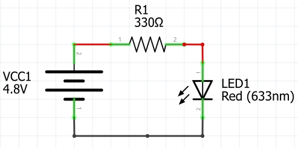

# Componentes electrónicos: resistencias, LEDs, protoboard.

## 1. El LED (El Mensajero Brillante) 💡

Es el componente que transforma la energía en luz.
Su superpoder: Avisarnos si hay energía en el circuito.
Regla de oro: Tiene polaridad. La pierna larga es el lado positivo (+) y la corta el negativo (-). Si lo conectas al revés, ¡no brilla!

## 2. La Resistencia (El Guardián del Tráfico) 🚧

Es una pieza pequeña con rayitas de colores. Su función es limitar el paso de la corriente.
Su superpoder: Proteger a los demás componentes (especialmente al LED) para que no reciban demasiada energía y se quemen.
Dato curioso: Los colores de sus rayitas son un "código secreto" que nos dice qué tan fuerte es el freno que pone.

## 3. El Protoboard (La Ciudad o Tablero de Juegos) 🔲

Es una tablilla llena de hoyitos donde encajamos los componentes sin necesidad de usar pegamento o soldadura.
Su superpoder: Permitirnos armar y desarmar circuitos miles de veces para experimentar.
Cómo funciona: Por dentro, los hoyitos están conectados por láminas de metal. Los hoyitos de las orillas (líneas rojas y azules) van a lo largo, y los del centro van hacia arriba y abajo.

## 4. Cables Jumper (Los Puentes Elevados) 🌉
Son cables de colores con puntas metálicas.
Su superpoder: Transportar la energía de un punto a otro de la ciudad (protoboard).
Tip de organización: Usamos el color Rojo para la energía que sale de la pila y el Negro para el camino de regreso a la pila.

[Video electronica](https://www.youtube.com/watch?v=CXvESLUK0Fk)

[Video proto1](https://www.youtube.com/watch?v=wOdlHIrvi80)

[Video proto2](https://www.youtube.com/watch?v=AaXXu292iNg)

## Actividad 

Ahora que conocen los componentes, vamos a montarlos correctamente en el Protoboard.
Instrucciones:

- Coloca el Protoboard.
- Energiza la ciudad: Conecta el cable Rojo de la batería al riel marcado con (+) y el cable Negro al riel (-).
- Instala el LED: Colócalo en el centro del protoboard (asegúrate de que cada pata esté en una columna distinta).
- Pon al Guardián (Resistencia): Conecta una resistencia desde el riel positivo (+) hasta la pata larga del LED. Determina el código de colores a 4 y 5 franjas de la resistencia utilizada.
- Cierra el camino: Conecta un cable desde la pata corta del LED hasta el riel negativo (-).

Tu circuito representa el siguiente diagrama, analizalo para entenderlo. 
