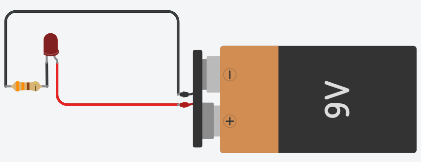

# ¿Qué es la electrónica? conceptos básicos, corriente y voltaje.

## 1. ¿Qué es la Electrónica?

Imagina que la electricidad es como un río de agua que corre con mucha fuerza. La electrónica es el arte de poner "compuertas", "tuberías" y "molinos" para decidir exactamente a dónde va esa agua y qué queremos que haga (como encender una luz o mover un motor).
En lugar de agua, en la electrónica usamos partículas pequeñísimas llamadas electrones.

## 2. Conceptos Básicos: El "Trío Dinámico"

Para que un juguete o un robot funcione, necesitamos entender tres cosas:

### A. El Voltaje (La Fuerza) 🔋
Es como la "presión" que empuja a los electrones para que se muevan.
Ejemplo: Imagina un tobogán. Entre más alto sea el tobogán, más fuerte caes. Una pila con mucho voltaje es como un tobogán muy alto.

### B. La Corriente (El Flujo) 🌊
Es la cantidad de electrones que pasan por un cable en un momento dado.
Ejemplo: Es como el chorro de agua de una manguera. Puede ser un chorrito delgado o un chorro muy grueso.

### C. La Resistencia (El Freno) 🛑
Es algo que intenta detener o frenar el paso de los electrones. Se usa para proteger los componentes y que no se quemen.
Ejemplo: Imagina que quieres correr por un pasillo, pero hay muchos obstáculos o personas estorbando. Eso te obliga a ir más lento.

## 3. El Circuito Eléctrico: El Camino de Ida y Vuelta
Los electrones son muy ordenados: siempre necesitan un camino cerrado para moverse. Si el camino se rompe (como cuando apagas un interruptor), los electrones se detienen.

Partes de un circuito básico:
- Fuente de energía: La pila (donde viven los electrones).
- Conductores: Los cables (el camino por donde viajan).
- Carga: Un LED o un motor (lo que queremos que funcione).
- Interruptor: El puente que se abre o se cierra.

## Actividad Mi faro brillante

El Reto 🚀
Imagina que estás en una isla desierta y necesitas construir un faro para que un barco te vea. Tienes una batería, un LED (tu foco) y un cable, pero ¡cuidado! Si conectas el LED directo a la batería sin una "falla de tráfico" (resistencia), el LED explotará por demasiada energía.

Entra a tinkercad y crea un nuevo circuito.
En el buscador de componentes (derecha), arrastra al centro:
- Una Batería de 9V.
- Un LED (puedes elegir el color que quieras).
- Una Resistencia (Resistor).

Crea el siguiente circuito:

Haz clic en el botón "Iniciar simulación".

**Si el LED enciende: ¡Felicidades! Lograste que los electrones fluyan por el camino correcto.**

### Preguntas de reflexión
¿Qué pasa si volteamos el LED?
¿Qué pasa si usamos una batería más pequeña (como una de reloj)?
¿Qué pasa si quitamos la resistencia y conectamos la terminal directo a negativo?
¿Para qué sirvió la resistencia?