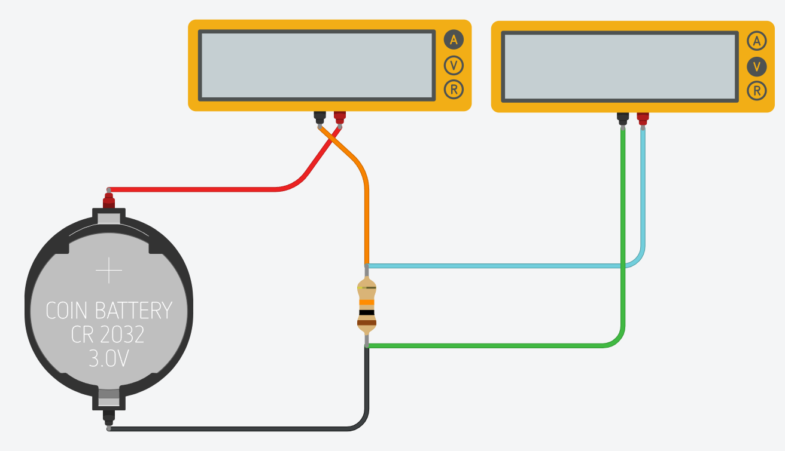
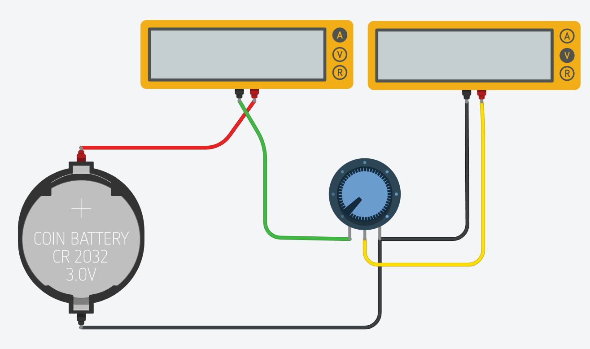

# La Ley de Ohm (El Equilibrio del Circuito) ⚖️⚡

## 1. La Gran Alianza: Voltaje, Corriente y Resistencia

Para que un circuito funcione perfecto, sus tres componentes deben llevarse bien. Si uno cambia, los otros también. Esto lo descubrió un señor llamado Georg Simon Ohm, y lo resumió en una regla mágica.

## 2. El Triángulo Mágico (La herramienta secreta)

[simulación de la ley de Ohm](https://phet.colorado.edu/sims/html/ohms-law/latest/ohms-law_all.html?locale=es)

Arma los siguiente circuitos, simulalos y explica los resultados:

## Reto

Resuelvan este acertijo usando su triángulo:
"Si tengo una batería de 9V y quiero que pasen exactamente 3 Amperes de corriente, ¿de cuánto debe ser mi resistencia?". Compruébalo simulándolo en tinkercad.