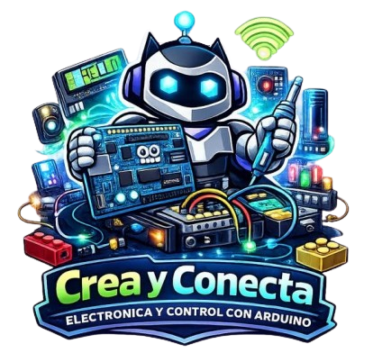

# **Crea y conecta electrónica y control con Arduino**

### Taller orientado al desarrollo de competencias tecnológicas mediante la exploración de la electrónica básica y la programación aplicada al control de dispositivos. A lo largo del curso, los participantes aprenderán a construir circuitos, interpretar señales eléctricas y programar microcontroladores, transformando ideas en prototipos funcionales.

#### *Nivel:* Introducción

#### *Duración:* 24 horas

#### *Perfil de los participantes:* Infancias, personas jóvenes y adultas interesadas en la tecnología, la electrónica o la robótica, así como integrantes de la comunidad que busquen desarrollar habilidades técnicas aplicables.

#### *Conocimientos previos:* no indispensables; se recomienda familiaridad básica con el uso de computadoras.

## Temario

- 1.Encuadre: presentación, expectativas y seguridad.
- [2.¿Qué es la electrónica? conceptos básicos, corriente y voltaje.](./ConceptosBasicos.md)
- [3.Componentes electrónicos: resistencias, LEDs, protoboard.](./ComponentesElectronicos.md)
- 4.Primer circuito: ley de Ohm. 
- 5.Introducción a Arduino: placa, entradas y salidas. 
- 6.Programación básica: mBlock. 
- 7.Señales digitales y analógicas.
- 8.Sensores: lectura de datos.
- 9.Integración de sistemas: hardware + software.
- 10.Diseño del proyecto: idea a solución. 
- 11.Pruebas y depuración.
- 12.Presentación final: demostración funcional.